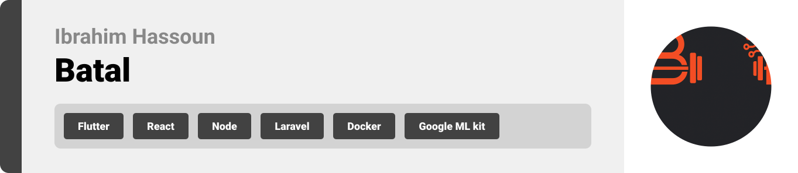
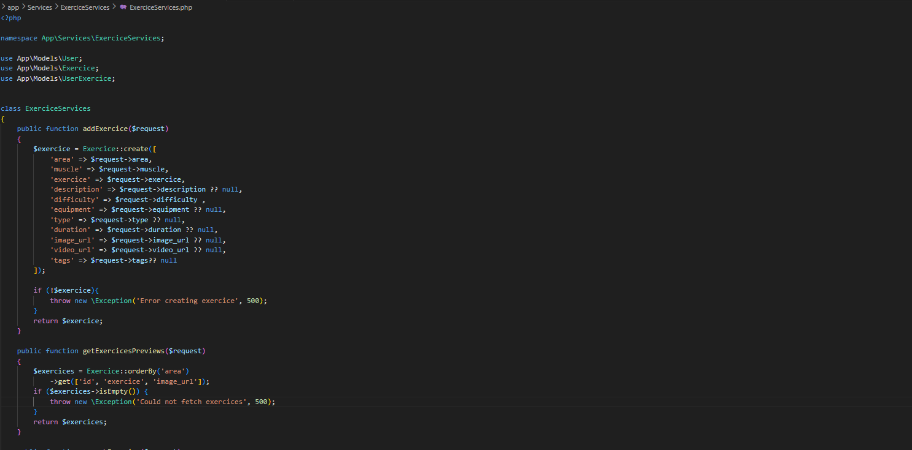

  

<!-- project overview -->

>Hey fellow gym batal 😄,

>I've got a present for you! Meet Batal, a mobile app designed to take your performance to
>beast level. With its powerful AI pose detector , it will track 🕵️, evaluate ✅, and provide live
>written and audio feedback 🎧 to help you correct your form in real time!

>But that’s just the beginning. Batal also includes a smart chatbot🤖that refines its answers just for
>you , based on your injuries, goals, fitness level, diet, and previous conversations. It can even 
>interact with your data, like adding saved exercises to your routine. No more overthinking your next 
>workout habibi! Batal’s recommendation system suggests the most effective exercises personalized 
>for you.Also guess what? We’ve cracked the age-old mystery of why the gym is suddenly packed!Thanks
>to a network of smart sensors, Batal now shows you live gym traffic updates 🚦so you can train 
>smarter, not just harder.

>Habibi,download Batal.

  

<!-- System Design -->

### ER Diagram

    

  

<!-- Project Highlights -->

### Experience the magic

- AI-powered pose detector with live feedback for each exercice.
- Traffic detector using sensors to get live feedback on gym traffic level.
- AI assistant that gives personalized advice based on previous interactions and profile.
- Recommendation system for diet/workout plans.
- Feed section that allows the abtal to upload posts and stories and interact with each others
- Live chatting system using node's websockets.

  

<!-- Demo -->

### User Screens (Mobile)

| Login screen                            | Register screen                       | Register screen                       |
| --------------------------------------- | ------------------------------------- | ------------------------------------- |
|  |  |  |

### Admin Screens (Web)

| Login screen                            | Register screen                       |
| --------------------------------------- | ------------------------------------- |
|  |  |

  

<!-- Development & Testing -->

### Add Title Here

| Services                            | Validation                       | Testing                        |
| --------------------------------------- | ------------------------------------- | ------------------------------------- |
|  |  |  |

  

<!-- Deployment -->

### Add Title Here

- Description here.

| Postman API 1                            | Postman API 2                       | Postman API 3                        |
| --------------------------------------- | ------------------------------------- | ------------------------------------- |
|  |  |  |

  
