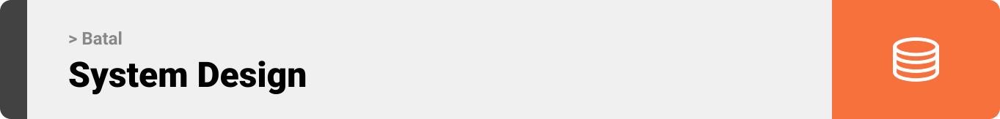
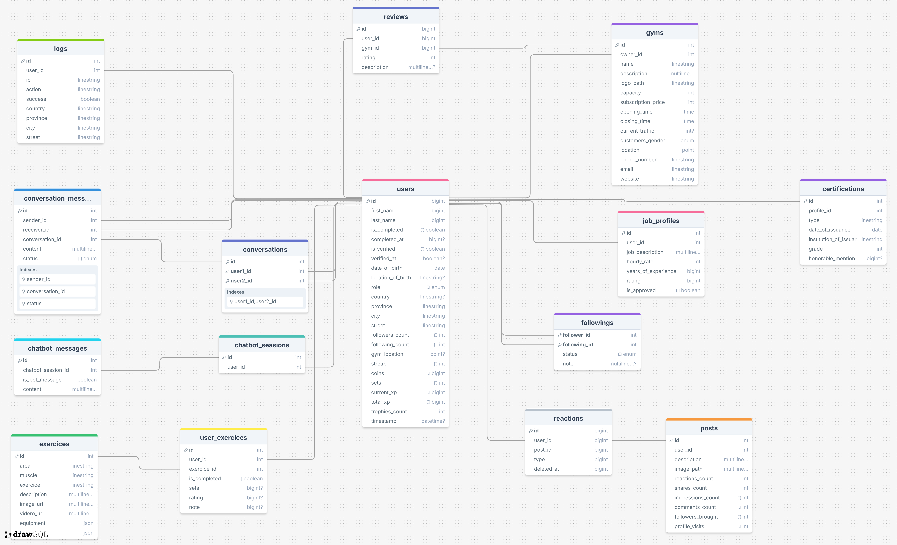

  

<!-- project overview -->

>Hey fellow gym batal 😄,

>I've got a present for you! Meet Batal, a mobile app designed to take your performance to
>beast level. With its powerful AI pose detector, it will track 🕵️, evaluate ✅, and provide live
>feedback to help you correct your form in real time!

>But that’s just the beginning. Batal also includes a smart chatbot 🤖 that refines its answers just for
>you, based on your history. Also, no more overthinking your next workout habibi!
>Batal’s recommendation system suggests effective exercises for you so that you stay
>pumped for the regular social media-style posts , live chat rooms and a gamified leaderboard 🎯

>Habibi, download Batal.

  

<!-- System Design -->

### ER Diagram

    

  

<!-- Project Highlights -->

### Experience the magic

- AI-powered pose detector with live feedback for each exercice.
- AI assistant that gives personalized advice based on previous interactions and profile.
- Recommendation system for diet/workout plans.
- Feed section that allows the abtal to upload posts and stories and interact with each others
- Live chatting system using node's websockets.

  

<!-- Demo -->

### User Screens (Mobile)

| Login screen                            | Register screen                       | Register screen                       |
| --------------------------------------- | ------------------------------------- | ------------------------------------- |
|  |  |  |

### Admin Screens (Web)

| Login screen                            | Register screen                       |
| --------------------------------------- | ------------------------------------- |
|  |  |

  

<!-- Development & Testing -->

### Add Title Here

| Services                            | Validation                       | Testing                        |
| --------------------------------------- | ------------------------------------- | ------------------------------------- |
|  |  |  |

  

<!-- Deployment -->

### CI/CD Workflows

- We start developing a new feature on a local branch
- We push said branch on its remote counterpart
- We merge remote branch to stage
- Github actions start the workflows
- Github actions attempt booting the database,then makes the migrations,testing and serving
- If CI succeeds,we proceed with staging CD
- Github actions pushes the code to the staging AWS EC2 instance and executes the deployment script
- The deployment script builds docker containers for laravel,node, database and react,one for each
- Once the feature is finished we merge stage to main
- Github actions takes the same staging CD steps again but for production

    

| Postman API 1                            | Postman API 2                       | Postman API 3                        |
| --------------------------------------- | ------------------------------------- | ------------------------------------- |
|  |  |  |

  
